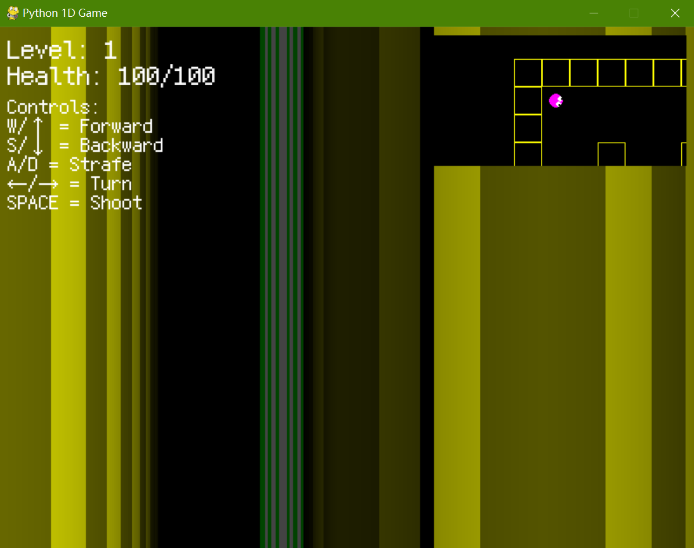

# 1D-Game: Python Port

> **⚠️ Important Notes:**
> 1. This game contains flashing colors that may be unsuitable for individuals with photosensitive epilepsy, especially with certain texture settings enabled.
> 2. The project is currently in **maintenance mode** as the author prepares for the 2026 Chinese Postgraduate Entrance Examination (approximately 150 days remaining).



## Description
Experience a unique first-person game from the perspective of a two-dimensional life form in this Python port of 1D-Game. Navigate procedurally generated levels, evade hostile enemies, and locate the exit portal to survive and progress through increasingly challenging environments.

This implementation preserves the core gameplay mechanics of [Mashpoe's original JavaScript version](https://github.com/mashpoe/1D-Game) while offering a clean, well-structured Python codebase. The game features the [Fusion Pixel Font](https://github.com/TakWolf/fusion-pixel-font) (12px variant) by TakWolf.

## Features

- **Immersive 1D Perspective**: Experience the world through a custom ray-casting system that simulates vision from a 2D entity's viewpoint
- **Procedurally Generated Levels**: Each playthrough offers unique pathways, enemy spawn points, and environmental layouts
- **Intelligent Enemy AI**: Evade hostile entities equipped with basic pathfinding capabilities
- **Distinct Visual Identity**: Enemy colors in the 1D view are precisely calibrated to RGB (255, 0, 192) to avoid visual overlap with the player
- **Dynamic Combat System**: Defend yourself by shooting bullets at enemies that enter your 1D field of view
- **Multiple Texture Packs**: Customize your visual experience with a selection of thematic texture packs
- **Optional 2D Minimap**: Enhance spatial awareness and navigation with an optional minimap overlay
- **Smooth Responsive Controls**: Enjoy fluid movement (forward/backward/strafing) and precise rotation mechanics

## Installation

### Prerequisites
- Python 3.8 or newer
- Pygame library (specified in `requirements.txt`)

### Setup Instructions
1. Clone or download this repository, then navigate to the project directory:
   ```bash
   git clone https://github.com/Pac-Dessert1436/python-1d-game.git
   cd python-1d-game
   ```
2. Install the required dependencies:
   ```bash
   pip install -r requirements.txt
   ```
3. Launch the game:
   ```bash
   python __main__.py
   ```

## Controls

### Movement
- **W / Up Arrow**: Move forward
- **S / Down Arrow**: Move backward
- **A**: Strafe left
- **D**: Strafe right
- **Left Arrow**: Rotate counterclockwise
- **Right Arrow**: Rotate clockwise

### Actions
- **Space**: Fire a bullet

### Menu & Options
- **Enter**: Confirm selections in dialog menus
- **Esc**: Close dialog menus or exit the game

## Gameplay Guide

1. **Core Objective**: Locate and reach the white exit portal to advance to the next, more challenging level
2. **Navigation**: Explore using the unique 1D perspective for an immersive experience, or enable the optional 2D minimap for better spatial orientation
3. **Combat Strategy**: Engage enemies by shooting them when they appear within your 1D field of view
4. **Enemy Threat**: Each enemy attack deals a consistent 10 HP of damage – prioritize evasion or elimination to survive
5. **Health Management**: Collect green health power-ups (marked by a green plus sign on the minimap) to restore 15 HP
6. **Progressive Difficulty**: Each subsequent level increases the challenge with higher enemy spawn rates and more complex level geometry

## Project Structure

```
python-1d-game/
├── __main__.py          # Main game entry point and core logic
├── essentials.py        # Game data structures and utility functions
├── game_dialog.py       # UI dialog system implementation
├── screenshot.png       # Gameplay screenshot
├── LICENSE              # BSD 3-Clause License document
└── README.md            # Project documentation (this file)
```

## Technical Implementation

- **Rendering Engine**: Custom ray-casting algorithm generates the unique 1D perspective view
- **Physics System**: Implements basic movement physics with acceleration, friction, and collision detection
- **Enemy AI**: Hostile entities use simple pathfinding algorithms to navigate levels
- **Texture System**: Supports 7 distinct texture packs for visual customization
- **Performance Optimization**: Features optimized rendering with adjustable quality settings

## License

This project is licensed under the BSD 3-Clause License. Refer to the [LICENSE](LICENSE) file for complete details.

## Attribution

- **Original Concept & JavaScript Implementation**: [Mashpoe](https://github.com/mashpoe/1D-Game)
- **Python Port Development**: Pac-Dessert1436
- **Font Asset**: [Fusion Pixel Font](https://github.com/TakWolf/fusion-pixel-font) by TakWolf

## Disclaimer

This software is provided "as is" without warranty of any kind, express or implied, including but not limited to the warranties of merchantability, fitness for a particular purpose, and noninfringement.

In no event shall the authors or copyright holders be liable for any claim, damages, or other liability, whether in an action of contract, tort, or otherwise, arising from, out of, or in connection with the software or the use or other dealings in the software.